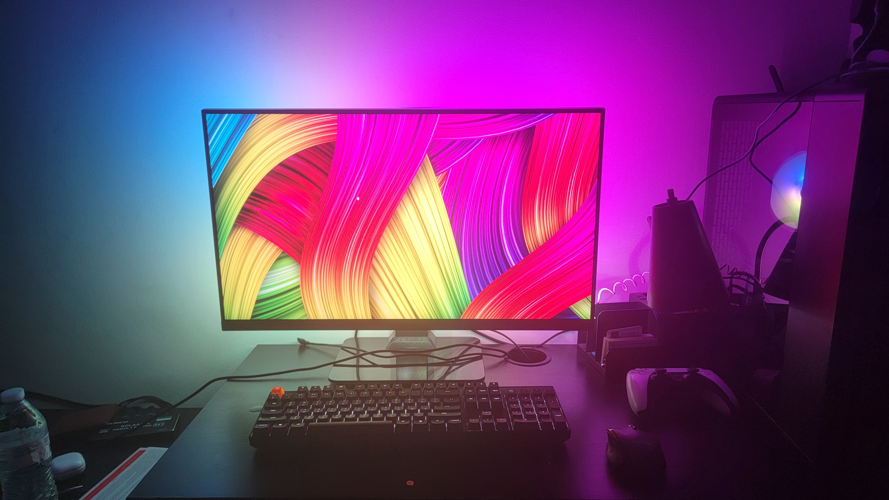
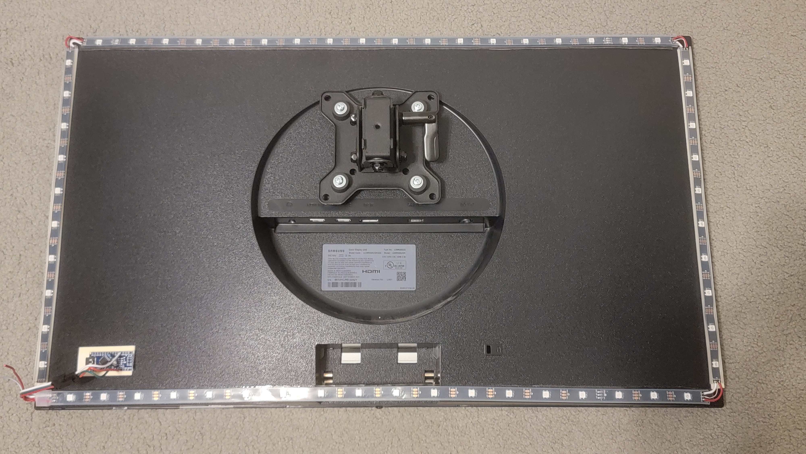

# Ambient Light System with Arduino
This project brings immersive ambient lighting to your monitor by extending the screen's visuals to an addressable LED strip controlled by an Arduino. The LED strip lights up specific regions of the screen, creating a dynamic lighting effect around your display. The project includes a GUI application for easy configuration and control of the lighting system, as well as a standalone Python script for use without the GUI.

## Features
* Real-Time Ambient Lighting: Synchronizes LED colors with designated zones on the screen, updating dynamically with on-screen content.
* Customizable LED Zones: Configure the number of LEDs per monitor edge, along with adjustable zone depth and edge spacing.
* Overlay Preview: A transparent preview overlay shows the LED zones on the screen, allowing easy positioning and configuration.
* Serial Communication with Arduino: Communicates with the Arduino via USB to control the LED strip based on screen data.
* System Tray Integration: Runs in the system tray for quick access to start, stop, and show/hide options.
* Port Detection and Refresh: Automatically detects and lists available serial ports for easy Arduino setup.

## Components
* Arduino Nano Controller: Receives color data via USB and controls the LED strip accordingly.
* Addressable LED Strip: Displays colors in real-time, reflecting screen zones.
* Python Application: Includes both a GUI-based configuration tool and a standalone script for direct, non-GUI use.

## Code Breakdown
* main.py: Entry point for the GUI application.
* config_app.py: Core application logic, managing serial communication, tray icon, and LED settings.
* gui.py: User interface components for the GUI.
* overlay_window.py: Handles the overlay preview for screen zones.
* ambient_light_controller.py: AmbientLightController: Manages the main ambient light processing loop
* zone_analyzer.py: Analyzes screen regions to determine colors for each LED zone.
* camera_handler.py: Captures frames from the screen
* arduino_controller.py: Communication with arduino script
* sletch_nov4a.ino: Arduino sketch for controlling the LED strip.
* nogui.py: Single script for ambilight without GUI
* test.py: Test performance of image capturing

## Performance
With my setup, using a 56-LED strip (18 LEDs per horizontal edge and 10 per vertical), I achieved a smooth 30 frames per second on a Ryzen 7 9700X CPU, RTX 4080 Super, 32GB of DDR5 RAM, and a 4K 60Hz display. At this resolution, the program runs at around 15% CPU usage, though increasing the zone depth can slow down performance due to the additional processing per frame. Running at lower resolutions could reduce CPU usage and potentially allow for higher frame rates, enhancing responsiveness while preserving the immersive ambient lighting experience.

[Watch the demo video on YouTube](https://youtu.be/XrmsfHwNfJc)

